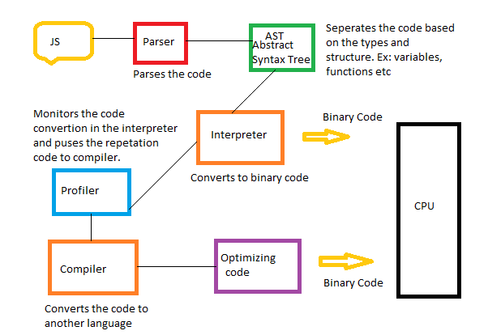

# JavaScript Engine 





```
+---------------------+
| JavaScript Source   |
+---------+-----------+
          |
          v
+---------------------+
|     Parser          |
+---------+-----------+
          |
          v
+---------------------+
| Abstract Syntax Tree|
+---------+-----------+
          |
          v
+---------------------+
|     Ignition        |
|   (Interpreter)     |
+---------+-----------+
          |
          v
+---------------------+
|     Bytecode        |
+---------+-----------+
          |
          v
+---------------------+
|     TurboFan        |
| (Optimizing Compiler)|
+---------+-----------+
          |
          v
+---------------------+
|   Optimized Machine |
|        Code         |
+---------------------+
```
